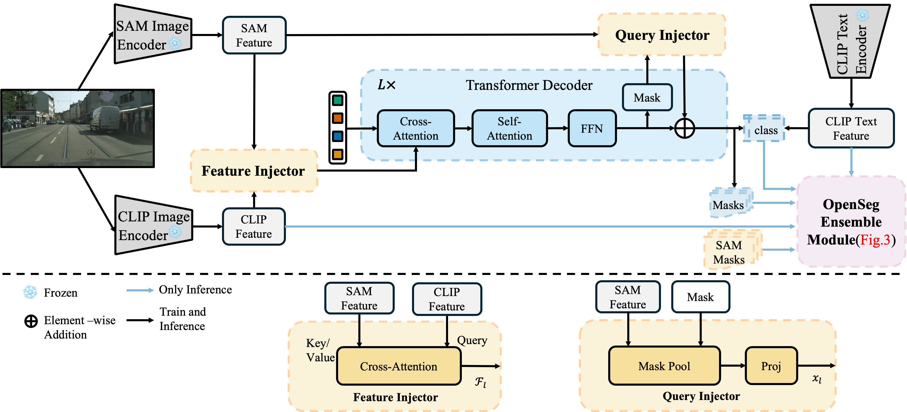

# CMPF: Harmonizing Cross-Model Prior Fusion for Open-Vocabulary Segmentation

This repository is the official implementation of CMPF introduced in the paper:
>[**CMPF: Harmonizing Cross-Model Prior Fusion for Open-Vocabulary Segmentation**](https://arxiv.org/abs/2409.03525)

## Abstract

>Open-vocabulary segmentation poses significant challenges, as it requires segmenting and recognizing objects across an open set of categories in unconstrained environments. Building on the success of powerful vision-language (ViL) foundation models, such as CLIP, recent efforts sought to harness their zero-shot capabilities to recognize unseen categories. Despite notable performance improvements, these models still encounter the critical issue of generating and recognizing precise mask proposals for unseen categories and scenarios, resulting in inferior segmentation performance eventually. To address this challenge, we introduce a novel Cross-Model Prior Fusion (CMPF) framework, an innovative framework that fuses visual knowledge from a localization foundation model (e.g., SAM) and text knowledge from a ViL model (e.g., CLIP), leveraging their complementary knowledge priors to overcome inherent limitations in mask proposal generation. Taking the ViL model’s visual encoder as the feature backbone, we propose Query Injector and Feature Injector to inject the visual localization feature into the learnable queries and CLIP features respectively, within a transformer decoder. In addition, an OpenSeg Ensemble strategy is designed to further improve mask quality by incorporating SAM’s universal segmentation masks during inference. To fully exploit pre-trained knowledge while minimizing training overhead, we freeze both foundation models, focusing optimization efforts solely on a lightweight transformer decoder for mask proposal generation – the performance bottleneck. Extensive experiments demonstrate that CMPF advances state-of-the-art results across various segmentation benchmarks, trained exclusively on COCO panoptic data, and tested in a zero-shot manner.

## Dependencies and Installation
See [installation instructions](INSTALL.md).

## Getting Started
See [Preparing Datasets](datasets/README.md).

See [Getting Started](GETTING_STARTED.md).

## Models
<table>
<thead>
  <tr>
    <th align="center"></th>
    <th align="center" style="text-align:center" colspan="4"><a href="logs/testing/ade20k.log">ADE20K(A-150)</th>
    <th align="center" style="text-align:center" colspan="3"><a href="logs/testing/cityscapes.log">Cityscapes</th>
    <th align="center" style="text-align:center" colspan="2"><a href="logs/testing/mapillary_vistas.log">Mapillary Vistas</th>
    <th align="center" style="text-align:center" colspan="2"><a href="logs/testing/bdd100k.log">BDD 100K</th>
    <th align="center" style="text-align:center" colspan="2"><a href="logs/testing/a-847.log"> A-847 </th>
    <th align="center" style="text-align:center" colspan="2"><a href="logs/testing/pc-459.log"> PC-459 </th>
    <th align="center" style="text-align:center" colspan="2"><a href="logs/testing/pas-21.log">PAS-21 </th>
    <th align="center" style="text-align:center" ><a href="logs/testing/lvis.log">Lvis </th>
    <th align="center" style="text-align:center" colspan="3"><a href="logs/testing/coco.log">COCO   (training dataset)</th>
    <th align="center" style="text-align:center">download </th>
  </tr>
</thead>
<tbody>
  <tr>
    <td align="center"></td>
    <td align="center">PQ</td>
    <td align="center">mAP</td>
    <td align="center">mIoU</td>
    <td align="center">FWIoU</td>
    <td align="center">PQ</td>
    <td align="center">mAP</td>
    <td align="center">mIoU</td>
    <td align="center">PQ</td>
    <td align="center">mIoU</td>
    <td align="center">PQ</td>
    <td align="center">mIoU</td>
    <td align="center">mIoU</td>
    <td align="center">FWIoU</td>
    <td align="center">mIoU</td>
    <td align="center">FWIoU</td>
    <td align="center">mIoU</td>
    <td align="center">FWIoU</td>
    <td align="center">APr</td>
    <td align="center">PQ</td>
    <td align="center">mAP</td>
    <td align="center">mIoU</td>
    <td></td>
  </tr>
    <td align="center"><a href="configs/coco/frozenseg/r50x64_eval_ade20k.yaml"> CMPF (ResNet50x64) </a></td>
    <td align="center">23.1</td>
    <td align="center">13.5</td>
    <td align="center">30.7</td>
    <td align="center">56.6</td>
    <td align="center">45.2</td>
    <td align="center">28.9</td>
    <td align="center">56.0</td>
    <td align="center">18.1</td>
    <td align="center">27.7</td>
    <td align="center">12.9</td>
    <td align="center">46.2</td>
    <td align="center">11.8</td>
    <td align="center">52.8</td>
    <td align="center">18.7</td>
    <td align="center">60.1</td>
    <td align="center">82.3</td>
    <td align="center">92.1</td>
    <td align="center">23.5</td>
    <td align="center">55.7</td>
    <td align="center">47.4</td>
    <td align="center">65.4</td>
    <td align="center"><a href="https://drive.google.com/file/d/1wiPKPczTXrH1cPrDbf-l9NGdOkMUUikw/view?usp=drive_link"> checkpoint </a></td>
  </tr>
  <tr>
    <td align="center"><a href="configs/coco/frozenseg/convnext_large_eval_ade20k.yaml"> CMPF (ConvNeXt-Large) </a></td>
    <td align="center">25.9</td>
    <td align="center">16.5</td>
    <td align="center">34.4</td>
    <td align="center">59.9</td>
    <td align="center">45.8</td>
    <td align="center">28.4</td>
    <td align="center">56.8</td>
    <td align="center">18.5</td>
    <td align="center">27.3</td>
    <td align="center">19.3</td>
    <td align="center">52.3</td>
    <td align="center">14.8</td>
    <td align="center">51.4</td>
    <td align="center">19.7</td>
    <td align="center">60.2</td>
    <td align="center">82.5</td>
    <td align="center">92.1</td>
    <td align="center">25.6</td>
    <td align="center">56.2</td>
    <td align="center">47.3</td>
    <td align="center">65.5</td>
    <td align="center"><a href="https://drive.google.com/file/d/1ThjVgY7nawm1AAP1LhrmGVlI3zr1EYMG/view?usp=drive_link"> checkpoint </a></td>
  </tr>
</tbody>
</table>

##  Acknowledgement
[Detectron2](https://github.com/facebookresearch/detectron2), [Mask2Former](https://github.com/facebookresearch/Mask2Former), [Segment Anything](https://github.com/facebookresearch/segment-anything), [OpenCLIP](https://github.com/mlfoundations/open_clip) and [FC-CLIP](https://github.com/bytedance/fc-clip/tree/main).
